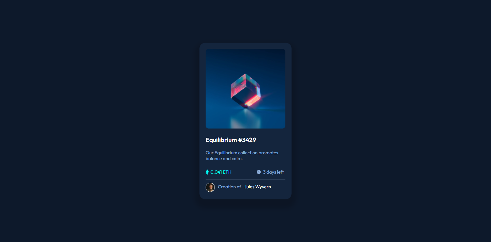

# Frontend Mentor - NFT preview card component solution

This is a solution to the [NFT preview card component challenge on Frontend Mentor](https://www.frontendmentor.io/challenges/nft-preview-card-component-SbdUL_w0U). Frontend Mentor challenges help you improve your coding skills by building realistic projects. 

## Table of contents

- [Overview](#overview)
  - [The challenge](#the-challenge)
  - [Screenshot](#screenshot)
  - [Links](#links)
- [My process](#my-process)
  - [Built with](#built-with)
  - [What I learned](#what-i-learned)
  - [Continued development](#continued-development)
  - [Useful resources](#useful-resources)
- [Author](#author)
- [Acknowledgments](#acknowledgments)

### The challenge

Users should be able to:

- View the optimal layout depending on their device's screen size
- See hover states for interactive elements

### Screenshot

### Links

- Solution URL: [Add solution URL here](https://idywilliams.github.io/NFT-CARD/)
- Live Site URL: [Add live site URL here](https://github.com/idyWilliams)

## My process

### Built with

- Semantic HTML5 markup
- CSS custom properties
- Flexbox

### What I learned
I got intriduced to css positioning, so i applied a little, i am still learning my semantic markup.. this is a just as aresult of three weeks in tech.. i belive i am improving on a dialy basis for myself.

### Continued development

### Useful resources

## Author

- Website - [https://github.com/idyWilliams/NFT-CARD.git](https://github.com/idyWilliams/NFT-CARD.git)
- Frontend Mentor - [i'williams](https://www.frontendmentor.io/profile/i'williams)
- Twitter - [@officialtanzyB](https://www.twitter.com/yourusername)

## Acknowledgments
FRONTENDMENTORS.IO